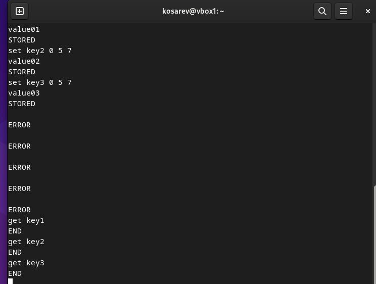
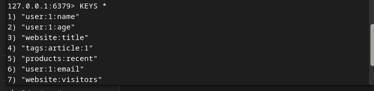

# Домашнее задание к занятию «Кеширование Redis/memcached»
## Косарев Д.О.

---

## Задание 1. Кеширование

### Проблемы, которые решает кеширование:

```bash
# 1. Высокая нагрузка на базу данных
#    Кеш принимает повторяющиеся read-запросы, снижая RPS к БД на 80-90%

# 2. Медленные вычисления и сложные запросы
#    Результаты ресурсоёмких операций сохраняются для повторного использования

# 3. Высокие задержки при обращении к внешним API
#    Данные кешируются локально, уменьшая зависимость от скорости внешних сервисов

# 4. Пиковые нагрузки на сервер
#    Кеш поглощает трафик, предотвращая перегрузку backend-систем

# 5. Высокая стоимость инфраструктуры
#    Меньше запросов к БД = меньше необходимых ресурсов = экономия денег


## Задание 2. Memcached


## Задание 3. Удаление по TTL в Memcached



## Задание 4. Запись данных в Redis



